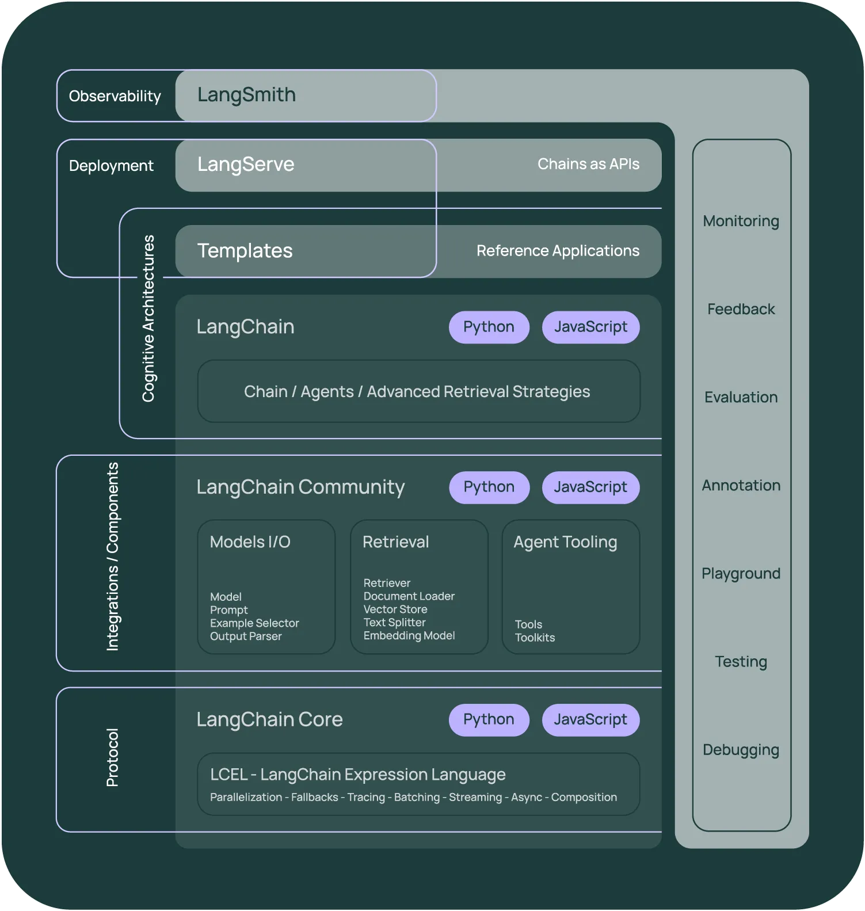
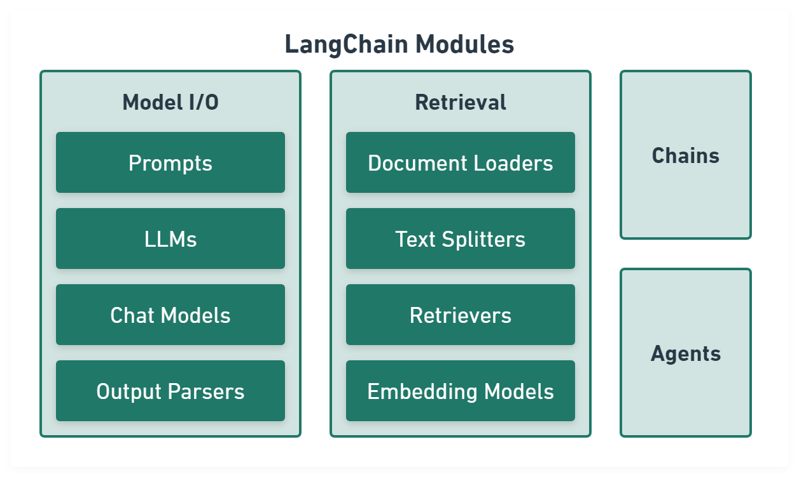
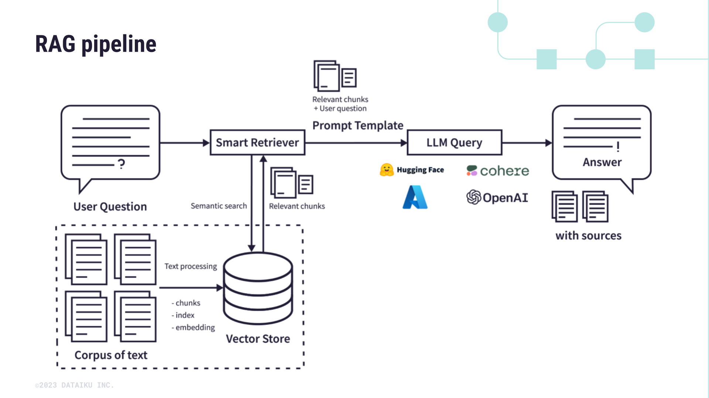

Langchain Projects

## Visual Overviews

### General Ecosystem
  
*This image provides a high-level view of Langchain's ecosystem, showcasing its modular design and the integration of various components such as chains, agents, retrievers, and vector databases.*

### Architecture Diagram
  
*This diagram highlights key components of Langchain, including:  
	- **Chains & Agents:** Modules to manage sequential tasks and decision-making.  
	- **Retrievers & RAG:** Systems to fetch and augment data for improved responses.  
	- **Vector Databases:** Integration with FAISS, Chroma, and more for efficient data storage and retrieval.  
	- **LLMs & Embeddings:** Support for models like OpenAI and Ollama, with embedding techniques from Hugging Face and others.  
	- **Langsmith & Langserve:** Tools to monitor, serve, and scale applications using FastAPI.*

### RAG Pipeline Overview
  
*This image illustrates the Retrieval-Augmented Generation (RAG) pipeline. It outlines how external data is retrieved and combined with language model outputs to improve response quality. The pipeline typically involves:  
	- **Data Retrieval:** Searching external databases for relevant context.  
	- **Integration:** Merging retrieved data with generated content.  
	- **Generation:** Producing enriched outputs that leverage both internal and external information.*

## About This Repository

This repository holds a variety of projects related to Langchain, including:

- **Chains, Retrievers, Tools & Agents:** Build and integrate dynamic components.
- **Retrieval-Augmented Generation (RAG):** Enhance outputs using external data sources.
- **Vector Databases:** Utilize FAISS, Chroma, and similar tools for efficient storage and retrieval.
- **Langsmith & Langserve:** Develop and serve applications with integrated monitoring and FastAPI support.
- **Large Language Models:** Experiment with OpenAI, Ollama models, and more.
- **Word Embeddings:** Implement diverse embedding techniques from Hugging Face, OpenAI, Ollama, etc.
